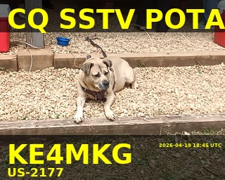

# POTA ParkPilot


<p align="center">
  
</p>

<p align="center">
  <em>Jade calling CQ SSTV POTA from US-2177 🐾</em>
</p>


POTA ParkPilot is a lightweight, field-ready assistant for Parks on the Air (POTA) activations.  
It runs on a Raspberry Pi or laptop and provides a browser-based interface for logging QSOs, managing sessions, and generating SSTV images directly from a tablet in the field.

⚠️ **Status: Experimental / Active Development**  
This project is functional but evolving. Expect rough edges and breaking changes.

---

## 🚀 Features

- 📡 **Live QSO Logging**
  - Manual entry via web UI
  - Multi-operator support (e.g., KE4MKG / KS4GY)
  - Upload ready POTA adif generation by operator

- 🔄 **WSJT-X Integration**
  - Automatically imports QSOs from WSJT-X ADIF log
  - Deduplicates contacts

- 🧾 **Session Management**
  - Tracks QSOs per activation
  - Per-operator stats and counts

- 🖼️ **SSTV Image Tools (Tablet-Integrated)**
  - Capture or upload images directly from a tablet in the field
  - Automatically overlay call, park, and timestamp
  - Generate POTA-themed SSTV images ready for transmission
  - Optional auto-copy to QSSTV transmit folder

- 📱 **Field-Ready Tablet Workflow**
  - Operate entirely from a tablet browser
  - Log QSOs, manage sessions, and generate SSTV images without a keyboard

- 🌐 **Tablet-Friendly Web UI**
  - Access from phone/tablet in the field

---

## 🧰 Requirements

### Minimum
- Python 3.9+
- Git

### Optional (Recommended)
- Raspberry Pi (for field deployment)
- WSJT-X (for digital modes)
- QSSTV (for SSTV transmission)

---

## 📦 Installation

### 1. Clone the repository

```bash
git clone https://github.com/YoJimboDurant/pota-parkpilot.git
cd pota-parkpilot
```

---

### 2. Create a virtual environment

#### Windows (PowerShell)
```powershell
python -m venv venv
.\venv\Scripts\activate
```

If you get execution policy errors:
```powershell
Set-ExecutionPolicy -Scope CurrentUser RemoteSigned
```

#### Linux / Raspberry Pi
```bash
python3 -m venv venv
source venv/bin/activate
```

---

### 3. Install dependencies

```bash
pip install -r requirements.txt
```

---

## ⚙️ Configuration

Edit:

```
config/parkpilot_config.json
```

### Key settings:

```json
{
  "operators": ["KE4MKG", "KS4GY"],
  "adif_file": "C:\\Users\\...\\wsjtx_log.adi",
  "poll_seconds": 2
}
```

### Notes:

- **Default operator = first in list**
- On Raspberry Pi, use:
  ```
  /home/pi/.local/share/WSJT-X/wsjtx_log.adi
  ```

---

## ▶️ Running the App

### Option 1 (Recommended)

```bash
python -m scripts.start_parkpilot
```

---

### Option 2 (Manual)

Run web UI:
```bash
python -m scripts.start_web
```

Run WSJT-X importer:
```bash
python -m scripts.start_wsjtx_service
```

---

## 🌐 Access the Interface

Open in browser:

```
http://localhost:5000
```

From another device (tablet/phone):

```
http://<your-pi-ip>:5000
```

---

## 🖼️ SSTV Setup (Optional)

To enable SSTV features:

```json
"sstv": {
  "enabled": true,
  "uploads_dir": "data/sstv/uploads",
  "rendered_dir": "data/sstv/rendered",
  "qsstv_image_dir": "/home/pi/qsstv/tx_sstv/",
  "auto_copy_to_qsstv": true
}
```

### Workflow:
1. Capture or upload image from tablet
2. Overlay call, park, and activation details
3. Image saved and optionally copied to QSSTV folder
4. Transmit via QSSTV

---

## 📁 Project Structure

```
parkpilot/
  core/           # Session management
  services/       # WSJT-X integration
  storage/        # JSON/session storage
  ui/web/         # Flask app + templates
  utils/          # ADIF + SSTV rendering

config/
  parkpilot_config.json

data/
  sessions/
  sstv/

scripts/
  start_web.py
  start_wsjtx_service.py
  start_parkpilot.py
```

---

## 🧪 Known Limitations

- UI is still evolving
- SSTV workflow is basic but functional
- Limited error handling
- No persistent database (JSON-based)

---

## 🔮 Roadmap Ideas

- 🔁 Dual-operator workflow improvements
- 📊 Enhanced stats and visualization
- 🔌 FLDIGI integration
- 🧠 Smarter automation of logging workflows

---

## 🤝 Contributing

This is currently a personal project, but feedback and ideas are welcome.

---

## 📜 License

This project is licensed under the MIT License.

See the [LICENSE](LICENSE) file for details.

---

## 📡 Author

Jim Durant (KE4MKG)  
GitHub: https://github.com/YoJimboDurant

---

## ☕ Final Note

This project was built to make POTA activations smoother, faster, and a little more fun.

If you have ideas for improvements, let me know! 73's!